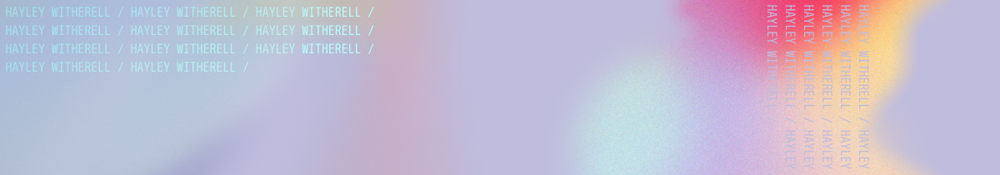

<picture>
  
</picture>

  

  
  
  
  
  
  
  
  
  
  

<picture>
  
</picture>

_[Stats Card](https://github.com/anuraghazra/github-readme-stats/) created by [anuraghazra](https://github.com/anuraghazra/) | [Markdown Badges](https://github.com/Ileriayo/markdown-badges) created by [Ileriayo](https://github.com/Ileriayo)_
 
