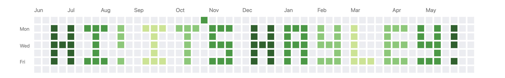

# 

### Introduction

  

                                             

  
  
  I'm a software engineer who works on cloud-based data analysis software by day, plus whatever other strange side-projects or tools are inspiring me by night.
  
  This is my personal account. My work account is [@hwitherellIDBS](https://github.com/hwitherellidbs).
                                                
  

      
  

  

                                               
---

### Technologies

#### Languages & Frameworks

  
  
  
  
  
  
  
  
  
  
  
  
  
  
  
  
  
  
  
  
  

#### Tools

  
  
  
  
  
  
  
  
  
  
  
  
  
  
  
  

#### Testing

  
  
  
  
  
  
  
  

#### Environments

  
  
  
  
  
  
  
  
  
  
  
  
  

