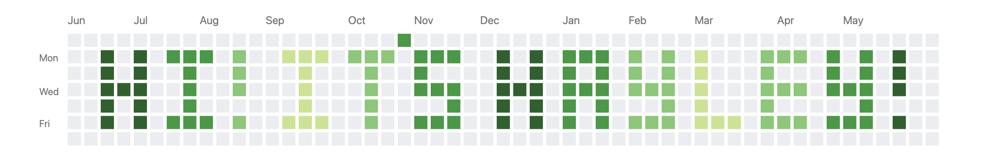

# 

### Introduction

  

                                             

  
  
  Hi! I am a software developer named Hayley.

  My portfolio here is populated with Turing School of Software & Design projects, which form a timeline of my coding journey, from learning vanilla JavaScript to implementing a framework.

  My largest applications are pinned below.
                                                
  

      
      
  

  

                                               
---

### Technologies

#### Languages

  
  
  
      
     
  
  
  

#### Builds, Package Management, & Version Control

 
  
  
  
     
  
  

#### Testing

  
  
     
  

#### Environments

  
      
   
     
     

#### Design & Content Creation

  
  
  
  
    
  

#### Operating Systems

  
  
  
    
  
  
  
  

